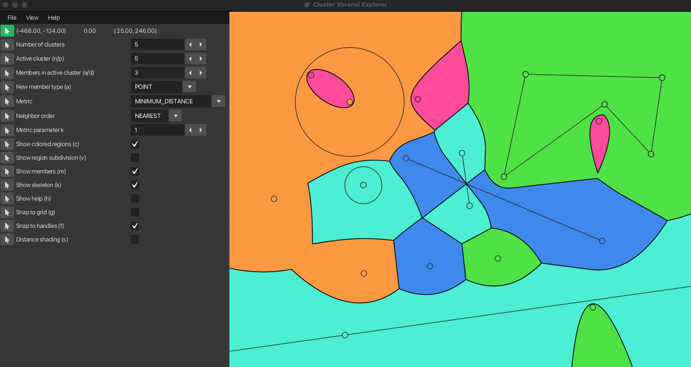

# cvd-explorer

**cvd-explorer** is an interactive visualization software for Voronoi diagrams. It supports **clusters of sites** (each site is a group of geometric members rather than a single point), **different distance metrics**, and **different input site types** (points, segments, circles, and lines).



For neighbor order, distance metrics, and input site types, see the **[documentation](docs/README.md)** ([metrics](docs/metrics.md), [site types](docs/site-types.md)).

## Building and running

### Prerequisites

- **JDK 25** with **JavaFX** available to the toolchain (same as CI: BellSoft Liberica **jdk+fx**, or another distribution that supplies the `javafx.controls` module used by the build).

### Commands

From the repository root:

```bash
chmod +x gradlew   # if needed
./gradlew build
```

Run tests with coverage report:

```bash
./gradlew test jacocoTestReport jacocoTestCoverageVerification -Pcoverage
```

GitHub Pages: enable **Actions** as the Pages source, then see [`.github/workflows/pages.yml`](.github/workflows/pages.yml) (site at `https://ioannisman.github.io/cvd-explorer/`).

Run the app:

```bash
./gradlew run
```

Produce a fat JAR (same artifact the [release workflow](.github/workflows/release.yml) uploads):

```bash
./gradlew shadowJar
# output: build/libs/cvd-explorer-all.jar
```

Run the JAR with a JDK that includes JavaFX, for example:

```bash
java --add-modules javafx.controls -jar build/libs/cvd-explorer-all.jar
```

## Documentation

- [docs/README.md](docs/README.md) — concepts and figures
- [CONTRIBUTING.md](CONTRIBUTING.md) — pull requests and collaboration
- [LICENSE.md](LICENSE.md) — MIT License
