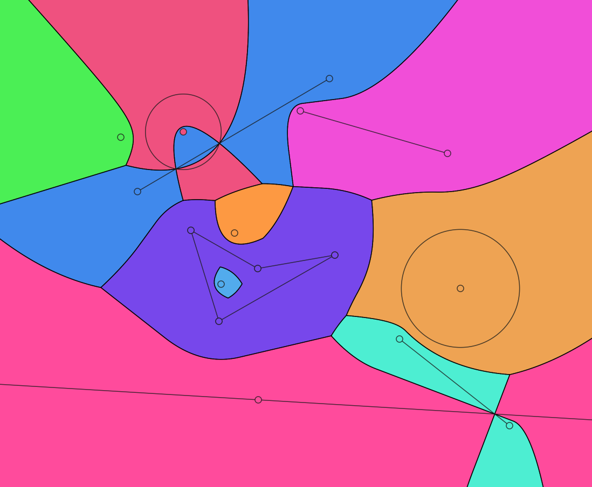
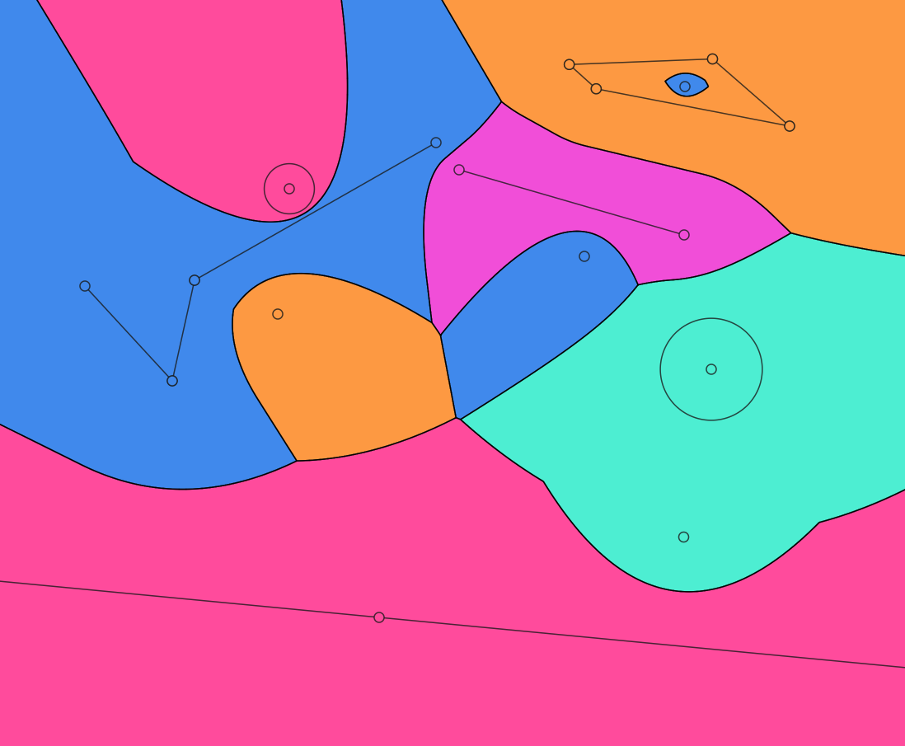
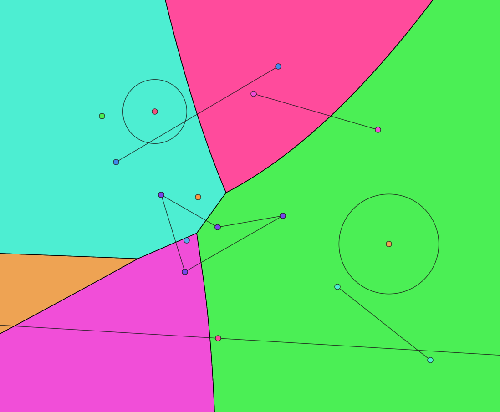
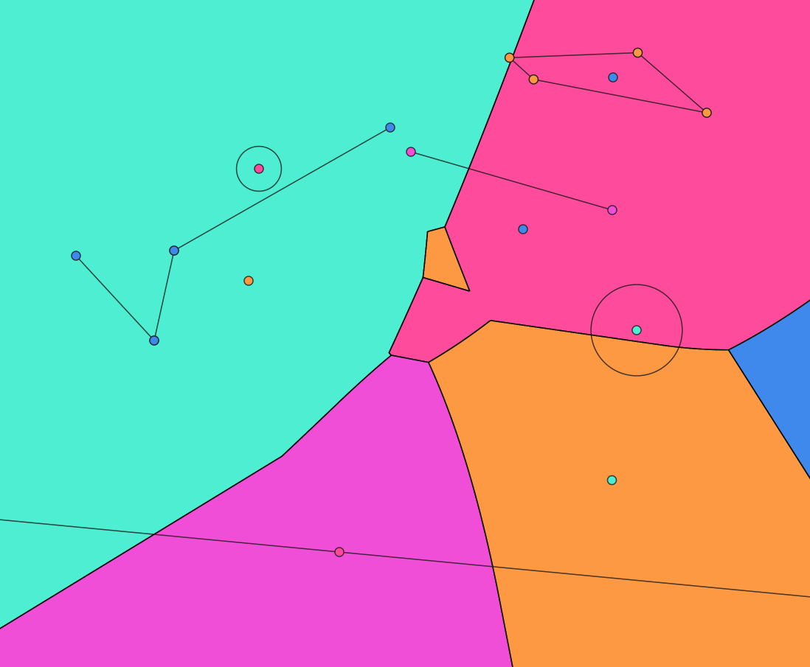

# cvd-explorer documentation

A **Voronoi diagram** partitions the plane into regions: each region contains the points that are closer to one site than to any other. In the classic case every site is a single point and distance is Euclidean. Voronoi diagrams can be generalized in many different ways, for example, the distance to a single point can be measured differently, the sites can be geometric objects other than points, or the plane might be subdivided according to the farthest neighbor.

Another generalization that encapsulates all the above is that of **Cluster Voronoi diagrams**. Now, each site is a **cluster** of geometric **members** (not just a single member). The distance of a query point in the plane is compared against each cluster; the cluster with the best distance owns that part of the plane. Our explorer lets you change three main settings—**neighbor order**, **member type**, and **metric**—and see the diagram update interactively.

| Nearest diagram of various objects | Nearest diagram of clusters with various objects |
|:---:|:---:|
|  |  |

The `Neighbor order` can be selected between `NEAREST` and `FARTHEST`. **Nearest** is the standard nearest-neighbor Voronoi diagram: the cluster with the **smallest** distance wins (see the figures above). **Farthest** is the farthest-neighbor-order Voronoi diagram: the cluster with the **largest** distance wins (see the figures below).

| Farthest diagram of various objects | Farthest diagram of clusters with various objects |
|:---:|:---:|
|  |  |

The `Member type` is the type of geometry that members in a cluster have. They can be of type `POINT`, `LINE_SEGMENT`, `CIRCLE`, `ELLIPSE`, or `LINE`. Polygons can also be created using line segments.

The `Metric` defines how a distance between a point in the plane and a site is measured. Each site is a cluster of members; the metric turns that into a single distance for the cluster (for example, the distance to the nearest or farthest member). Available metrics are `MINIMUM_DISTANCE`, `MAXIMUM_DISTANCE`, `SUM_OF_DISTANCES`, `MEAN_DISTANCE`, and `KTH_NEAREST_DISTANCE`.

## More information

- **[Metrics](metrics.md)** — definitions and images
- **[Site types](site-types.md)** — definitions and images
