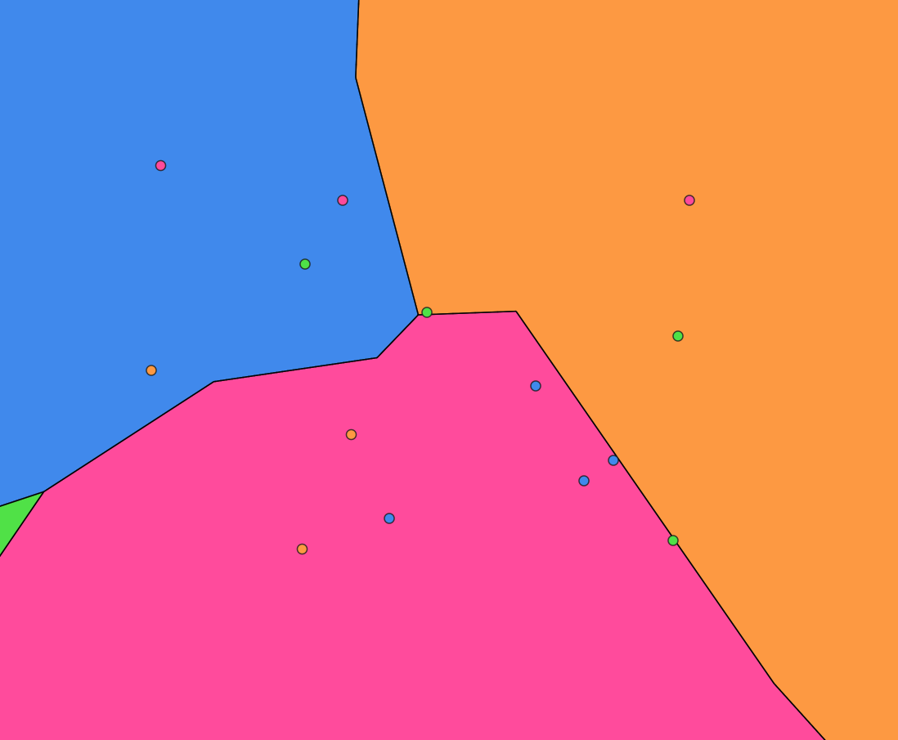
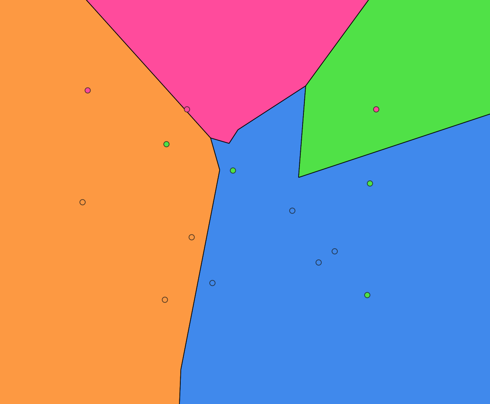
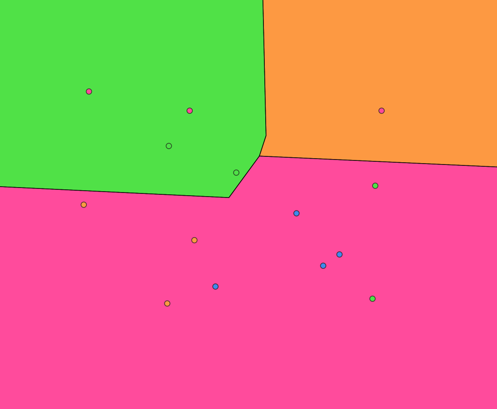
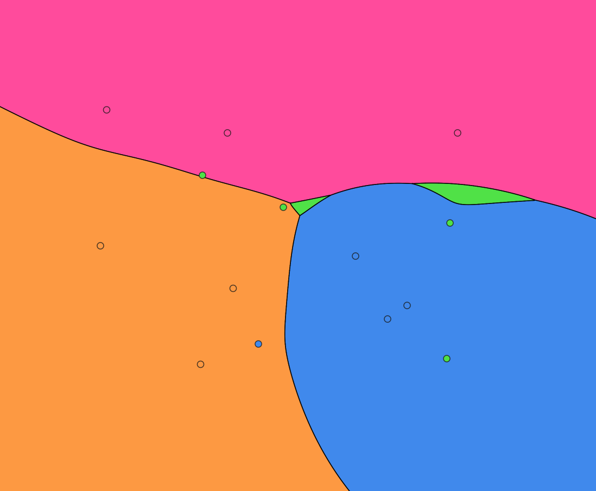
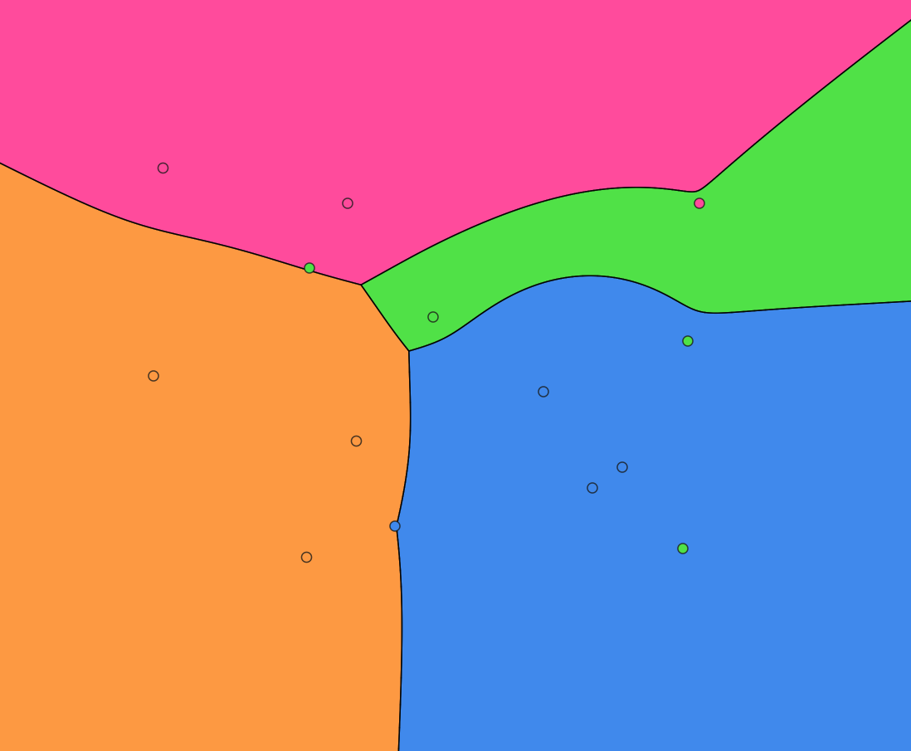
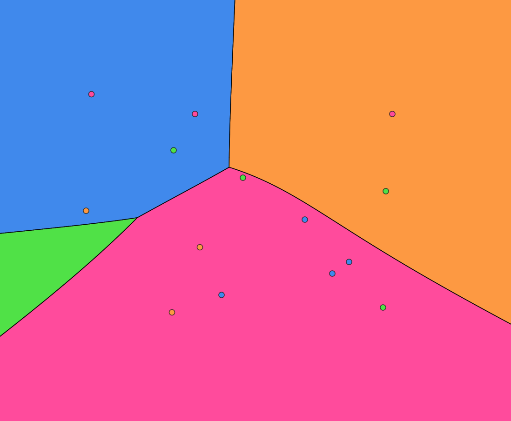
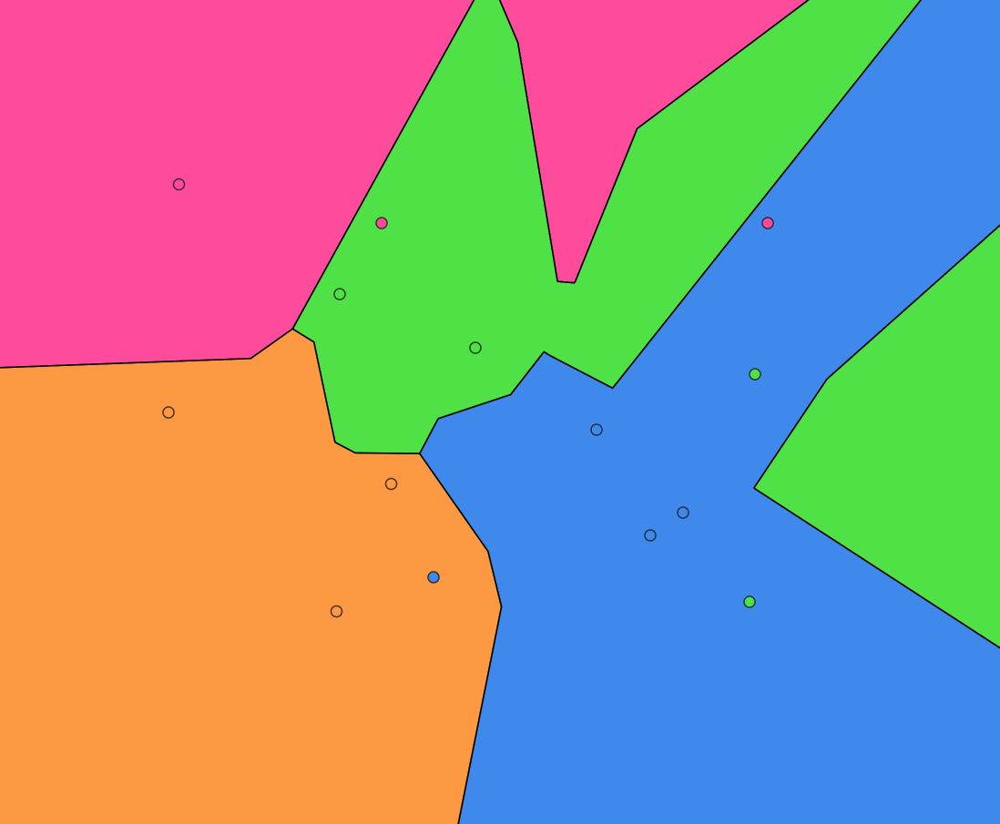
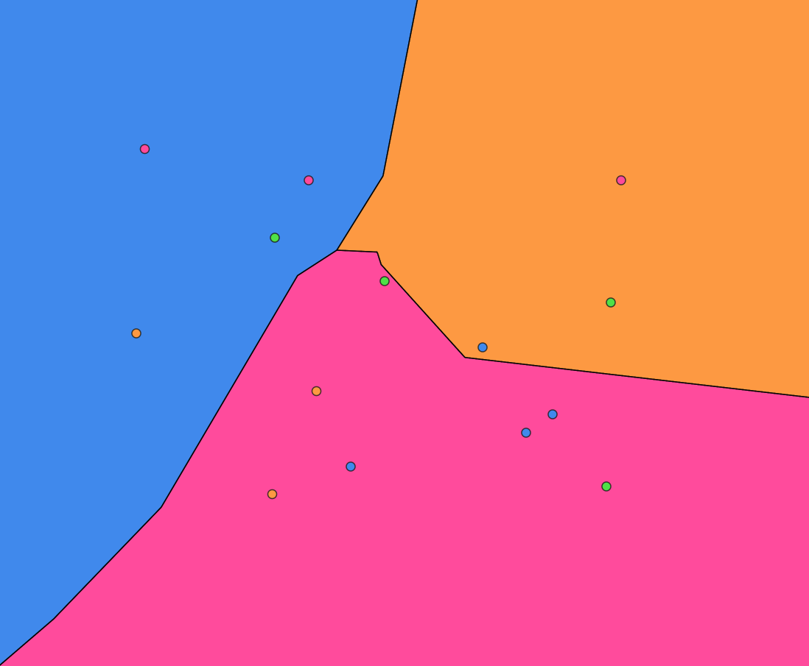

# Metrics and neighbor order

[← Documentation home](README.md)

## Neighbor order

After the distance to each cluster is computed, **neighbor order** picks the owner:

| Order | Wins when |
|-------|-----------|
| `NEAREST` | The cluster with the **smallest** distance |
| `FARTHEST` | The cluster with the **largest** distance |

## Distance metrics

Each metric defines how the distance from a query point to a cluster is measured. The same neighbor order is then applied across clusters.

The metrics below are illustrated with **clusters of point members** only (`points_*` figures). Each definition is followed by two images: **nearest** and **farthest** neighbor order.

The sum, mean, and *k*-th nearest metrics apply only when every member in every cluster is a point.

### `MINIMUM_DISTANCE`

Distance to the nearest member in that cluster.

| Nearest (min-min) | Farthest (max-min) |
|:---:|:---:|
|  |  |

### `MAXIMUM_DISTANCE`

Distance to the farthest member in that cluster.

| Nearest (min-max) | Farthest (max-max) |
|:---:|:---:|
|  |  |

### `SUM_OF_DISTANCES`

Sum of distances to every point member in the cluster. **Points only.**

| Nearest (min-sum) | Farthest (max-sum) |
|:---:|:---:|
|  |  |

### `MEAN_DISTANCE`

Average of distances to all point members in the cluster. **Points only.**

| Nearest (min-mean) | Farthest (max-mean) |
|:---:|:---:|
|  |  |

### `KTH_NEAREST_DISTANCE`

Distance to the *k*-th nearest point member in that cluster. *k* = 1 is the same as `MINIMUM_DISTANCE`. **Points only.** Examples use *k* = 2.

| Nearest (min-2nd) | Farthest (max-2nd) |
|:---:|:---:|
|  |  |
